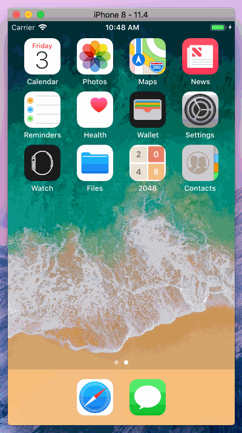

# Fibonacci

Fibonacci is a single-player game for iPhone. The game's objective is to slide numbered tiles on a grid to combine them to create tiles with larger numbers using [Fibonacci Numbers](https://en.wikipedia.org/wiki/Fibonacci_number). The app is based on 2048, a web game designed by Italian web developer Gabriele Cirulli. This version uses the Fibonacci sequence rather than the classic powers of two.

| 2048 Web Game | Fibonacci iOS 12 |
|------------------------|--------------------|
|  | 

## Overview

The game is played on a gray 5×5 grid, with numbered tiles that slide smoothly when a player moves them using the four arrow keys. Every turn, a new tile will randomly appear in an empty spot on the board with a value of either 2 or 3. Tiles slide as far as possible in the chosen direction until they are stopped by either another tile or the edge of the grid. If two tiles in the Fibonacci sequence collide while moving, they will merge into a tile with the total value of the two tiles that collided. The resulting tile cannot merge with another tile again in the same move. Higher-scoring tiles emit a soft glow.

A scoreboard on the upper-right keeps track of the user's score. The user's score starts at zero, and is incremented whenever two tiles combine, by the value of the new tile. As with many arcade games, the user's best score is shown alongside the current score.

The simple gameplay mechanics (just four directions) allowed it to be used in a promo video for the Myo gesture control armband, the availability of the code underneath allowed it to be used as a teaching aid for programming, and the second-place winner of a coding contest at Matlab Central Exchange was an AI system that would play 2048 on its own.

There also exists another type of this game, called 177147, which is actually used with exponents of 3 instead of 2. This version goes beyond that adding a bit more of nerdiness by allowing the user to learn and practice the Fibonacci sequence.
